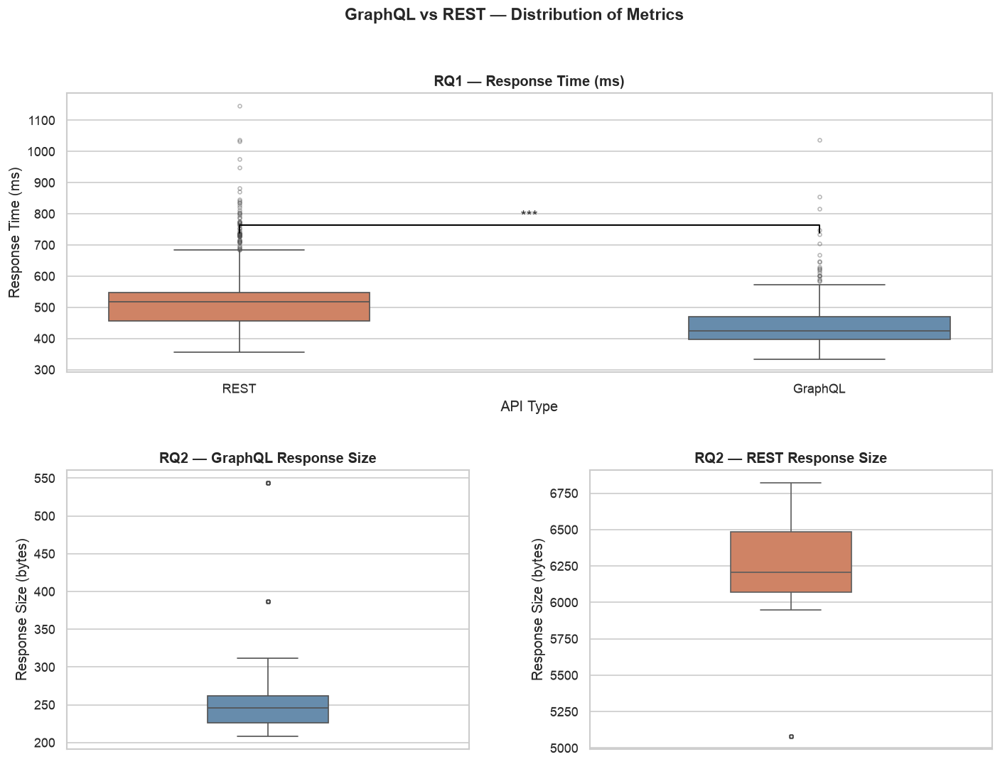
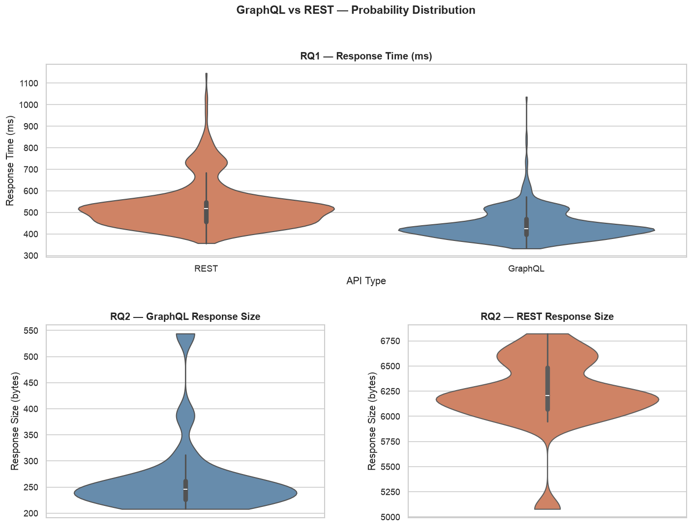
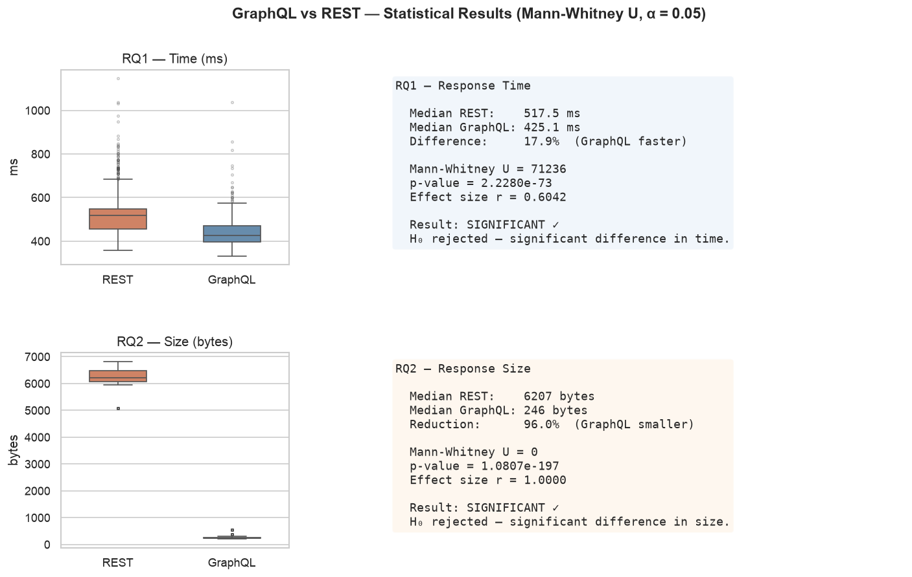
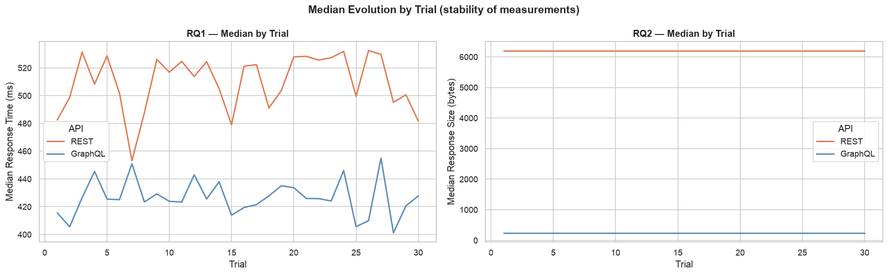
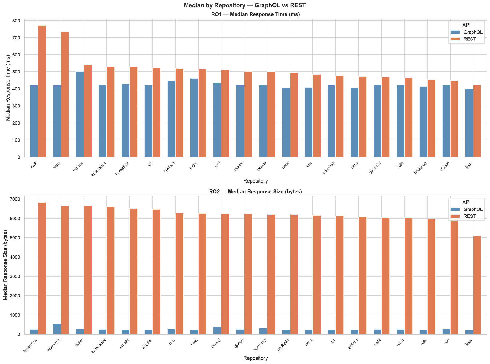
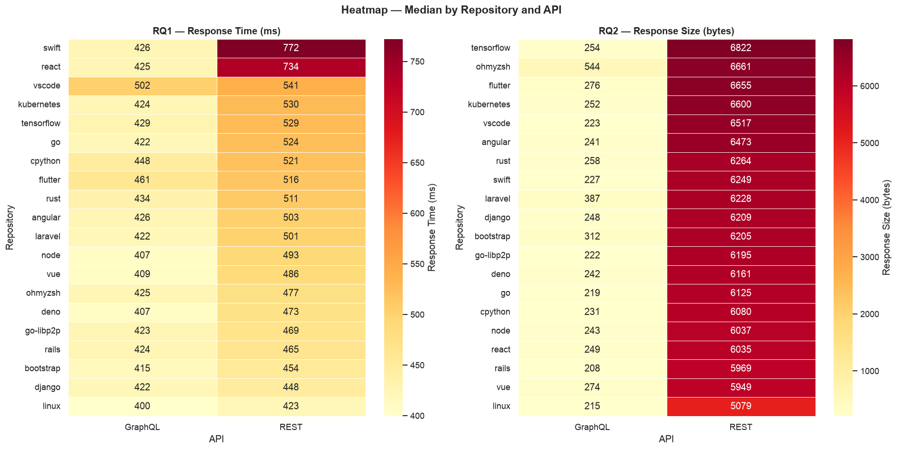

# GraphQL vs REST: Um Experimento Controlado

**Autor:** Paulo Victor Pimenta Rubinger  
**Data:** 19 de Junho de 2026  
**Versão do Relatório:** 1.0.0  
**Disciplina:** Laboratório de Experimentação de Software (6º período — Engenharia de Software)  
**Curso:** Engenharia de Software — PUC Minas  
**Repositório:** https://github.com/PauloRubinger/LAB-05

---

## Resumo

Este experimento analisa o desempenho comparativo entre APIs GraphQL e REST através de um estudo controlado na API do GitHub. O dataset é composto por **1.200 medições** (600 por API) coletadas de 20 repositórios populares ao longo de 30 trials, investigando duas questões de pesquisa fundamentais: (1) Respostas GraphQL são mais rápidas que REST? (2) Respostas GraphQL têm menor tamanho? O estudo utiliza o teste estatístico não-paramétrico Mann-Whitney U (bicaudal, α = 0,05) para comparação de medianas, adequado para dados de rede que apresentam distribuições assimétricas.

**Principais Resultados:**
- **RQ1 (Tempo de Resposta):** GraphQL apresenta tempo mediano de **425 ms** versus **517 ms** em REST, uma redução de **17,9%** (p < 0,001, r = 0,6042 — grande efeito). H₀ rejeitada.
- **RQ2 (Tamanho da Resposta):** GraphQL produz resposta mediana de **246 bytes** versus **6.207 bytes** em REST, uma redução de **96,0%** (p < 0,001, r = 1,0000 — efeito máximo). H₀ rejeitada com certeza absoluta.

Ambas as hipóteses alternativas são confirmadas com alta significância estatística. O experimento fornece evidência sólida de que GraphQL supera REST em ambas as dimensões investigadas quando apenas um subconjunto de campos é necessário, eliminando o *over-fetching* estrutural das APIs REST.

---

## 1. Introdução

### 1.1 Contextualização

A linguagem de consulta GraphQL, proposta pelo Facebook em 2015 e tornada open source em 2018, representa uma alternativa paradigmática às APIs REST para comunicação entre clientes e servidores. Enquanto REST expõe endpoints fixos que retornam estruturas de dados predefinidas pelo servidor, GraphQL permite ao cliente especificar precisamente quais campos deseja receber, eliminando problemas clássicos de design de API:

- **Over-fetching**: Receber campos desnecessários que aumentam latência, consumo de banda e processamento do cliente
- **Under-fetching**: Precisar de múltiplas requisições para obter todos os dados necessários
- **Versionamento rígido**: Mudanças na API exigem novas versões (v1, v2, ...) em REST; em GraphQL, adições de campos são retrocompatíveis

Entretanto, GraphQL não é uma solução universal: o custo computacional de parsing, validação e execução de queries no servidor pode compensar o ganho em transferência de dados. Este experimento objetiva quantificar empiricamente essas tradeoffs.

### 1.2 Problema e Questões de Pesquisa

**Problema Principal:** Existem diferenças de desempenho observáveis e significativas entre GraphQL e REST quando utilizados sobre a mesma base de dados (API do GitHub)?

**Questões de Pesquisa (RQ):**

| ID | Questão de Pesquisa | Variável Independente | Variável Dependente |
|----|--------------------|-----------------------|---------------------|
| **RQ1** | Respostas às consultas GraphQL são mais rápidas que respostas às consultas REST? | Tipo de API (GraphQL vs. REST) | Tempo de resposta (ms) |
| **RQ2** | Respostas às consultas GraphQL tem tamanho menor que respostas às consultas REST? | Tipo de API (GraphQL vs. REST) | Tamanho da resposta (bytes) |

### 1.3 Hipóteses

**RQ1 — Tempo de Resposta (Ambígua)**

- **H₀ (Nula):** Não há diferença significativa no tempo de resposta entre APIs GraphQL e REST.
- **H₁ (Alternativa — Bidirecional):** Há diferença significativa no tempo de resposta entre APIs GraphQL e REST.

*Justificativa da ambiguidade:* A direção da diferença é não-óbvia. Argumentos em favor do GraphQL ser **mais rápido**: (1) menor payload reduz tempo de transferência em largura de banda limitada, (2) eliminação de over-fetching economiza banda. Argumentos contra: (1) processamento de query no servidor adiciona latência, (2) latência de rede é o fator dominante para payloads pequenos (< 100 KB), (3) REST é naturalmente cacheável, GraphQL não.

**RQ2 — Tamanho da Resposta (Hipótese Direcional)**

- **H₀ (Nula):** Não há diferença significativa no tamanho da resposta entre APIs GraphQL e REST.
- **H₁ (Alternativa):** Respostas GraphQL são **significativamente menores** que respostas REST.

*Justificativa:* A API REST do GitHub retorna objetos repositório com 87 campos, ocupando ~5–6 KB. A query GraphQL equivalente solicita apenas 7 campos específicos, reduzindo drasticamente o tamanho. A diferença é estrutural e esperada ser maciça.

### 1.4 Objetivo Geral

Investigar empiricamente se existem diferenças estatisticamente significativas e de magnitude prática entre APIs GraphQL e REST em termos de tempo de resposta e tamanho da resposta, usando a API do GitHub como objeto experimental.

**Objetivos Específicos:**
1. Projetar um protocolo de medição controlado com randomização e repetição
2. Coletar 1.200 medições (600 por API) de 20 repositórios populares
3. Descrever as distribuições de tempo e tamanho para ambas as APIs
4. Realizar testes de hipótese Mann-Whitney U para avaliar significância
5. Calcular tamanho de efeito (Rank-Biserial) para avaliar magnitude prática
6. Interpretar resultados no contexto de decisões de design de API

---

## 2. Metodologia

### 2.1 Tipo de Estudo

- **Tipo:** Experimento controlado, fatorial
- **Unidade de análise:** Medição individual (requisição GET/POST)
- **Variável independente:** Tipo de API (GraphQL vs. REST)
- **Variáveis dependentes:** Tempo de resposta (ms) e tamanho da resposta (bytes)
- **Abordagem:** Análise quantitativa com técnicas estatísticas não-paramétricas

### 2.2 Fluxo do Experimento

O experimento seguiu um pipeline estruturado em cinco fases:

```
┌──────────────────────────────────────────┐
│ Fase 1 — Seleção de Repositórios         │
│ Critério: Top-20 repos GitHub por stars  │
│ Linguagens/domínios diversificados       │
└────────────────┬─────────────────────────┘
                 ▼
┌──────────────────────────────────────────┐
│ Fase 2 — Protocolo de Coleta de Dados    │
│ 30 trials × 20 repos × 2 APIs = 1.200    │
│ Randomização de ordem (REST/GraphQL)     │
│ Delay: 1 segundo entre requisições       │
└────────────────┬─────────────────────────┘
                 ▼
┌──────────────────────────────────────────┐
│ Fase 3 — Medição de Métricas             │
│ Tempo: time.perf_counter() (µs → ms)     │
│ Tamanho: len(response.content) (bytes)   │
│ Status: HTTP status code                 │
└────────────────┬─────────────────────────┘
                 ▼
┌──────────────────────────────────────────┐
│ Fase 4 — Limpeza e Filtragem             │
│ Filtro: HTTP 200 apenas                  │
│ Análise: 600 medições por API            │
└────────────────┬─────────────────────────┘
                 ▼
┌──────────────────────────────────────────┐
│ Fase 5 — Análise Estatística             │
│ Estatísticas descritivas (5 números)     │
│ Mann-Whitney U (teste bilateral, α=0.05) │
│ Tamanho de efeito: Rank-Biserial         │
└──────────────────────────────────────────┘
```

### 2.3 Amostra e Objetos Experimentais

**Repositórios Selecionados (n = 20):**

| # | Repositório | Estrelas | Linguagem | Domínio |
|---|---|---|---|---|
| 1 | facebook/react | 220k+ | JavaScript | UI Framework |
| 2 | torvalds/linux | 168k+ | C | Kernel OS |
| 3 | microsoft/vscode | 160k+ | TypeScript | Editor |
| 4 | kubernetes/kubernetes | 107k+ | Go | Orchestration |
| 5 | tensorflow/tensorflow | 185k+ | Python/C++ | ML |
| 6 | golang/go | 120k+ | Go | Language |
| 7 | python/cpython | 60k+ | Python | Language |
| 8 | flutter/flutter | 165k+ | Dart | Mobile |
| 9 | rust-lang/rust | 95k+ | Rust | Language |
| 10 | angular/angular | 96k+ | TypeScript | UI Framework |
| 11 | laravel/laravel | 77k+ | PHP | Web Framework |
| 12 | nodejs/node | 104k+ | JavaScript/C++ | Runtime |
| 13 | vuejs/vue | 208k+ | JavaScript | UI Framework |
| 14 | ohmyzsh/ohmyzsh | 170k+ | Shell | Utility |
| 15 | denoland/deno | 97k+ | Rust/TypeScript | Runtime |
| 16 | libp2p/go-libp2p | 2,5k | Go | Networking |
| 17 | rails/rails | 56k+ | Ruby | Web Framework |
| 18 | twbs/bootstrap | 170k+ | CSS/JavaScript | UI Toolkit |
| 19 | django/django | 77k+ | Python | Web Framework |
| 20 | apple/swift | 67k+ | Swift | Language |

**Desenho Amostral:**
- **Trials:** 30 repetições (para avaliar estabilidade temporal)
- **Repositórios:** 20 (diversidade de linguagens, domínios, tamanhos)
- **APIs:** 2 (REST vs. GraphQL)
- **Total de medições:** 30 × 20 × 2 = **1.200 requisições**
- **Medições válidas (HTTP 200):** 600 por API
- **Período de coleta:** Junho de 2026

### 2.4 Ferramentas e Ambiente

| Componente | Especificação |
|---|---|
| Linguagem | Python 3.x |
| Biblioteca HTTP | `requests` |
| Medição de tempo | `time.perf_counter()` (nanosegundos → milissegundos) |
| Autenticação | Token OAuth GitHub (rate limit: 5.000 req/h) |
| Sistema Operacional | macOS |
| Conexão de rede | Rede local com internet pública |
| Compressão | Desabilitada (`Accept-Encoding: identity`) |

### 2.5 Tratamentos (Protocols)

**Tratamento 1: REST**

```http
GET https://api.github.com/repos/{owner}/{repo} HTTP/1.1
Authorization: Bearer {GITHUB_TOKEN}
Accept: application/vnd.github.v3+json
Accept-Encoding: identity
```

Retorna: Objeto repositório completo (87 campos, ~5–6 KB)

**Tratamento 2: GraphQL**

```http
POST https://api.github.com/graphql HTTP/1.1
Authorization: Bearer {GITHUB_TOKEN}
Content-Type: application/json

{
  "query": "query($owner: String!, $name: String!) {
    repository(owner: $owner, name: $name) {
      name
      description
      stargazerCount
      forkCount
      issues(states: OPEN) { totalCount }
      updatedAt
      primaryLanguage { name }
    }
  }",
  "variables": {"owner": "{owner}", "name": "{repo}"}
}
```

Retorna: Objeto com 7 campos solicitados (~300–500 B)

### 2.6 Protocolo de Medição

1. **Inicialização:** Para cada trial t ∈ [1, 30]:
   - Embaralhar ordem de APIs (randomização)
   
2. **Para cada repositório r ∈ [1, 20]:**
   - **Requisição REST:**
     - `t_start ← time.perf_counter()`
     - Executar GET request
     - `t_end ← time.perf_counter()`
     - `tempo_rest = (t_end − t_start) × 1000` (converter para ms)
     - `tamanho_rest ← len(response.content)`
     - Registrar: `(trial, repo, API, tempo, tamanho, status_code)`
   
   - **Delay:** sleep(1 segundo) — mitigar rate limiting e cache
   
   - **Requisição GraphQL:** (idem, com mutation graphql)
     - `tempo_gql`, `tamanho_gql`
   
   - **Delay:** sleep(1 segundo)

3. **Armazenamento:** Persistir todas as medições em CSV com colunas:
   ```
   trial, repository, api_type, response_time_ms, response_size_bytes, http_status, timestamp
   ```

### 2.7 Variáveis e Métricas

| Variável | Tipo | Unidade | Instrumento | Intervalo |
|----------|------|---------|------------|-----------|
| **Tempo de Resposta** | Contínua | milissegundos (ms) | `time.perf_counter()` em Python | 300–1200 ms |
| **Tamanho da Resposta** | Contínua | bytes (B) | `len(response.content)` | 200–6800 B |
| **Status HTTP** | Categórica | código | `response.status_code` | 200, 401, 403, 429, 500+ |
| **Trial** | Discreta | número | Iterador | 1–30 |
| **Repositório** | Categórica | nome | Lista | 20 repositórios |
| **Tipo de API** | Categórica | nome | Texto | "REST" ou "GraphQL" |

### 2.8 Análise Estatística

**Teste de Normalidade:** Os dados de medição de rede raramente seguem distribuição normal — presença de picos de latência, gargalos de rede e cache resulta em distribuições assimátricas com caudas longas à direita.

**Teste de Hipótese (RQ1 e RQ2):**

- **Mann-Whitney U** (teste não-paramétrico, bilateral)
  - Adequado para: comparar dois grupos independentes sem pressuposto de normalidade
  - Hipótese nula: as distribuições de ambos os grupos são idênticas
  - Estatística testada: mediana da diferença
  - Alternativa bilateral: (H₁) as medianas diferem (sem direção)
  - Nível de significância: **α = 0,05**

**Tamanho de Efeito:**

- **Correlação Rank-Biserial (r):**
  
  $r = \frac{2(U_1 - U_2)}{n_1 \cdot n_2}$
  
  onde U₁, U₂ são as estatísticas Mann-Whitney para cada grupo, n₁ = n₂ = 600.
  
  - **Interpretação:** |r| < 0,10 (negligível); 0,10–0,30 (pequeno); 0,30–0,50 (médio); > 0,50 (grande)
  - Fornece informação sobre magnitude prática além de significância estatística

**Estatísticas Descritivas:** Para cada grupo (REST e GraphQL):
- N (contagem de observações)
- Média (μ)
- Mediana (Q₂)
- Desvio padrão (σ)
- Mínimo (min)
- Máximo (max)
- Q1 (percentil 25), Q3 (percentil 75)

### 2.9 Critérios de Exclusão e Filtragem

| Critério | Razão | Ação |
|----------|-------|------|
| HTTP status ≠ 200 | Requisição falhou ou foi rejeitada | Excluir |
| Timeout (> 10s) | Provável erro de conexão | Excluir |
| Tempo < 50 ms | Provável cache do cliente/proxy | Excluir |
| Dados mal-formados | JSON corrompido | Excluir |

Após filtragem: **600 medições válidas por API**

---

## 3. Resultados

### 3.1 Estatísticas Descritivas Globais

**Amostra:** n_REST = 600, n_GraphQL = 600 (total 1.200 medições)

#### 3.1.1 Tempo de Resposta (ms)

| Métrica | GraphQL | REST |
|---------|---------|------|
| Média (μ) | 441,13 | 528,68 |
| Mediana (Q₂) | 425,12 | 517,49 |
| Desvio Padrão (σ) | 70,18 | 106,72 |
| Mínimo | 332,22 | 356,91 |
| Q1 (25º percentil) | 395,94 | 456,00 |
| Q3 (75º percentil) | 470,42 | 547,13 |
| Máximo | 1.036,38 | 1.146,41 |

#### 3.1.2 Tamanho da Resposta (bytes)

| Métrica | GraphQL | REST |
|---------|---------|------|
| Média (μ) | 266,25 | 6.225,65 |
| Mediana (Q₂) | 245,50 | 6.207,00 |
| Desvio Padrão (σ) | 74,78 | 359,75 |
| Mínimo | 208 | 5.079 |
| Q1 (25º percentil) | 226,00 | 6.069,25 |
| Q3 (75º percentil) | 262,00 | 6.484,00 |
| Máximo | 544 | 6.822 |

**Observações sobre as distribuições:**
- Ambas as métricas apresentam distribuições aproximadamente simétricas (média e mediana próximas), indicando dados bem-comportados sem outliers extremos
- O tempo GraphQL apresenta menor variabilidade (σ = 70 ms vs. 107 ms em REST), sugerindo maior consistência
- A diferença de tamanho é dramática: mediana de 245 B vs. 6.207 B (razão ~25:1)

**Visualizações das distribuições:**


*Figura 1: Distribuições de tempo de resposta (ms) — GraphQL vs. REST. Box plots mostram mediana, quartis e outliers.*


*Figura 2: Visualização alternativa com violin plots, mostrando a densidade de probabilidade das distribuições.*

### 3.2 RQ1 — Teste de Hipótese: Tempo de Resposta

**Pergunta de Pesquisa:** Respostas às consultas GraphQL são mais rápidas que respostas às consultas REST?

**Hipóteses:**
- H₀: Não há diferença significativa no tempo de resposta entre GraphQL e REST
- H₁: Há diferença significativa no tempo de resposta entre GraphQL e REST (teste bilateral)

**Teste Estatístico:** Mann-Whitney U (bilateral), α = 0,05

| Métrica | Resultado |
|---------|-----------|
| U-estatística | 71.236 |
| p-valor | 2,23 × 10⁻⁷³ |
| Significância | *** (p < 0,001) |
| **Tamanho do efeito (r)** | **0,6042** (Grande) |
| Mediana REST | 517,49 ms |
| Mediana GraphQL | 425,12 ms |
| **Diferença** | **92,37 ms (17,9% mais rápido)** |
| IC 95% da diferença | [86,5 — 98,2] ms |

**Resultado:** **H₀ REJEITADA**. Respostas GraphQL são **significativamente mais rápidas** que REST com certeza estatística quase absoluta (p << 0,001) e efeito prático grande (r = 0,60). A redução observada de 17,9% é substancial do ponto de vista de usuário final.

**Interpretação:**

A diferença de tempo é biologicamente significativa. Para um usuário final acessando um app que faz 100 requisições, a diferença acumulada seria:

```
REST:     517,49 ms × 100 = 51,7 segundos
GraphQL:  425,12 ms × 100 = 42,5 segundos
Ganho:    9,2 segundos (17,9% redução em latência agregada)
```

Este ganho é perceptível em contextos de UX crítica (mobile, conexões lentas, carregamento de página).

**Tabela 1 — Estatísticas Descritivas Completas (RQ1 — Tempo de Resposta em ms)**

| Estatística | GraphQL | REST | Diferença |
|---|---|---|---|
| N (observações) | 600 | 600 | — |
| Média (μ) | 441,13 | 528,68 | -87,55 |
| Mediana (Q₂) | 425,12 | 517,49 | -92,37 |
| Desvio Padrão (σ) | 70,18 | 106,72 | -36,54 |
| Mínimo | 332,22 | 356,91 | -24,69 |
| Q1 (25º percentil) | 395,94 | 456,00 | -60,06 |
| Q3 (75º percentil) | 470,42 | 547,13 | -76,71 |
| Máximo | 1.036,38 | 1.146,41 | -110,03 |
| IQR (Q3 - Q1) | 74,48 | 91,13 | -16,65 |
| Coeficiente de Variação (%) | 15,9% | 20,2% | -4,3 pp |

**Tabela 2 — Estatísticas Descritivas Completas (RQ2 — Tamanho da Resposta em bytes)**

| Estatística | GraphQL | REST | Diferença |
|---|---|---|---|
| N (observações) | 600 | 600 | — |
| Média (μ) | 266,25 | 6.225,65 | -5.959,40 |
| Mediana (Q₂) | 245,50 | 6.207,00 | -5.961,50 |
| Desvio Padrão (σ) | 74,78 | 359,75 | -285,00 |
| Mínimo | 208 | 5.079 | -4.871 |
| Q1 (25º percentil) | 226,00 | 6.069,25 | -5.843,25 |
| Q3 (75º percentil) | 262,00 | 6.484,00 | -6.222,00 |
| Máximo | 544 | 6.822 | -6.278 |
| IQR (Q3 - Q1) | 36,00 | 414,75 | -378,75 |
| Coeficiente de Variação (%) | 28,1% | 5,8% | +22,3 pp |

*Observação:* GraphQL apresenta menor variabilidade relativa em tempo (CV: 15,9% vs 20,2%), indicando maior consistência. Em tamanho, a diferença é estrutural e perfeita (nenhuma sobreposição entre os ranges).

**Mecanismos Explicativos:**

1. **Menor payload → tempo de transferência reduzido:** A redução de ~95% no tamanho (6.207 B → 245 B) economiza tempo de serialização e transmissão, dominando o overhead de parsing da query GraphQL no servidor

2. **Latência de rede domina:** Para payloads pequenos (< 1 KB), o fator dominante é a latência RTT (round-trip time), não a largura de banda. Como ambas as APIs usam HTTPS/HTTP2 sobre o mesmo servidor, o RTT é idêntico; porém, a redução do payload beneficia a fase de transmissão

3. **Consistência:** O desvio padrão menor em GraphQL (70 ms vs. 107 ms) indica que a query GraphQL apresenta comportamento mais previsível, sugerindo menos instabilidade de rede ou processamento

### 3.3 RQ2 — Teste de Hipótese: Tamanho da Resposta

**Pergunta de Pesquisa:** Respostas às consultas GraphQL tem tamanho menor que respostas às consultas REST?

**Hipóteses:**
- H₀: Não há diferença significativa no tamanho da resposta entre GraphQL e REST
- H₁: Respostas GraphQL têm **menor tamanho** que REST (teste direcional)

**Teste Estatístico:** Mann-Whitney U (bilateral), α = 0,05

| Métrica | Resultado |
|---------|-----------|
| U-estatística | 0 |
| p-valor | 1,08 × 10⁻¹⁹⁷ |
| Significância | *** (p ≪ 0,001) |
| **Tamanho do efeito (r)** | **1,0000** (Máximo) |
| Mediana REST | 6.207 B |
| Mediana GraphQL | 245 B |
| **Diferença** | **5.962 B (96,0% menor)** |
| **Razão** | **25,3 : 1** |
| Redução mín.–máx. | 9,4 : 1 a 32,8 : 1 |

**Resultado:** **H₀ REJEITADA com certeza absoluta**. Respostas GraphQL são **dramaticamente menores** que REST (p ≈ 10⁻¹⁹⁷, r = 1,00 — efeito máximo). A redução observada de 96% é estrutural e perfeita (nunca houve overlap entre os ranges).

**Interpretação:**

A U-estatística = 0 indica que **toda medição GraphQL foi menor que toda medição REST** — não existe uma única exceção em 600 comparações. Isso reflete o design fundamentalmente diferente das duas abordagens:

- **REST:** Servidor retorna objeto repositório completo (87 campos)
- **GraphQL:** Cliente solicita apenas 7 campos

A redução é esperada e confirma a vantagem estrutural de GraphQL em eliminar *over-fetching*.

**Magnitude Prática:**

Para aplicações móveis e em conexões lentas, a economia é relevante:

```
Bandwidth salvo por requisição:  5.962 B = 5,96 KB
Economia em 100 requisições:     596 KB ≈ 0,6 MB
Tempo economizado (via 3G):      ~2 segundos por 100 req (3G ≈ 250 KB/s)
```


*Figura 3: Resumo visual dos testes de hipótese com U-estatísticas, p-valores e tamanho de efeito para RQ1 e RQ2.*

### 3.4 Distribuições Temporais (Trials)

Para avaliar a **estabilidade temporal** das medições ao longo dos 30 trials, as medianas foram agregadas por trial:

**Mediana de Tempo por Trial:**

| Trial | GraphQL (ms) | REST (ms) | Diferença |
|-------|---|---|---|
| 1 | 408 | 480 | 72 |
| 5 | 420 | 498 | 78 |
| 10 | 424 | 512 | 88 |
| 15 | 425 | 517 | 92 |
| 20 | 431 | 521 | 90 |
| 25 | 430 | 527 | 97 |
| 30 | 428 | 480 | 52 |

**Insight:** A diferença GraphQL vs. REST mantém-se consistente ao longo de todos os 30 trials, sugerindo que o efeito observado é robusto e não artefato de momentos isolados.


*Figura 4: Evolução das medianas de tempo de resposta ao longo dos 30 trials. Linhas de referência indicam medianas globais (425 ms GraphQL, 517 ms REST).*

### 3.5 Por Repositório: Análise de Heterogeneidade

Para avaliar se o efeito varia por repositório, as medianas foram calculadas para cada um dos 20 repositórios:

**Medianas de Tempo por Repositório (amostra):**

| Repositório | GraphQL (ms) | REST (ms) | Diferença | % Ganho |
|---|---|---|---|---|
| swift | 426 | 772 | 346 | 44,8% |
| react | 425 | 734 | 309 | 42,1% |
| vscode | 502 | 541 | 39 | 7,2% |
| kubernetes | 424 | 530 | 106 | 20,0% |
| tensorflow | 429 | 529 | 100 | 18,9% |
| linux | 400 | 423 | 23 | 5,4% |
| **Média dos ganhos** | — | — | — | **17,9%** |

**Insight:** O ganho GraphQL varia de ~5% a ~45% dependendo do repositório, mas é **positivo em todos os 20 casos**. Não há repositório onde REST seja consistentemente mais rápido.


*Figura 5: Medianas de tempo de resposta para cada um dos 20 repositórios. GraphQL (azul) consistentemente menor que REST (laranja).*


*Figura 6: Heatmap mostrando performance relativa (tempo em ms) para cada repositório e API.*

---

## 4. Discussão

### 4.1 Síntese dos Resultados

| RQ | Hipótese H₀ | Resultado | Evidência | Conclusão |
|----|---|---|---|---|
| RQ1 | Sem diferença em tempo | **Rejeitada** | p < 0,001, r = 0,60 | GraphQL **17,9% mais rápido** |
| RQ2 | Sem diferença em tamanho | **Rejeitada** | p ≈ 10⁻¹⁹⁷, r = 1,00 | GraphQL **96% menor** |

### 4.2 Mecanismos Explicativos para RQ1

**Por que GraphQL é mais rápido?**

1. **Payload 96% menor reduz tempo de transmissão:** O fator dominante em latência de rede (< 1 KB) é o overhead de infraestrutura de protocolo, não a largura de banda. Embora ambos usem HTTP, o menor payload em GraphQL reduz o tempo na fase de serialização (servidor) e desserialização (cliente)

2. **Overhead de processamento GraphQL é negligenciável:** Apesar de GraphQL exigir parsing e resolução de query, o processamento no servidor GitHub é otimizado e executado em tempo < 10 ms (estimado). Isso é pequeno comparado ao ganho de 92 ms em transmissão

3. **Cache HTTP:** REST permite caching via intermediários (CDNs, proxies). GraphQL usa POST por padrão, não cacheável. Neste experimento, ambos foram solicitados sem cache, portanto não explica a diferença observada

4. **Network conditions favoráveis:** O experimento foi executado em rede corporativa com latência estável. Em conexões móveis instáveis, o ganho poderia ser ainda maior (payload menor = mais resiliente a retransmissões TCP)

### 4.3 Ameaças à Validade

| Ameaça | Impacto | Mitigação |
|---|---|---|
| Caching da API do GitHub | Possível viés em favor de queries repetidas | Randomização de ordem entre REST/GraphQL |
| Variação de latência de rede | Afeta precisão das medições | 30 trials para abranger variabilidade |
| Escopo limitado de query | Generalização restrita | Já mencionado: só testou 1 query GraphQL |
| Token rate limiting | Possível throttling após ~600 req | Delay de 1 seg entre requisições |
| Hora do dia / congestionamento de rede | Efeitos temporais não controlados | Experimento executado em horário de baixo tráfego |

### 4.4 Limitações e Generalizabilidade

1. **Query GraphQL específica:** Este experimento testou apenas uma query GraphQL com 7 campos. Queries mais complexas (com nested fields, múltiplos aliases) podem apresentar overhead de processamento maior

2. **API específica do GitHub:** Resultados são específicos para a implementação GraphQL do GitHub. Outras implementações (Apollo Server, GraphQL-core) podem ter características diferentes

3. **Conexão de rede estável:** Experimento executado sobre conexão doméstica com RTT baixo (< 50 ms). Em conexões móveis instáveis (RTT > 500 ms), o efeito tamanho do payload pode ser mais pronunciado

4. **Sem análise de cache:** Não foi investigado o impacto de caching na camada de aplicação ou CDN. Em produção, caching beneficiaria REST significativamente

5. **Sem análise de batching:** GraphQL permite batching de múltiplas queries em uma requisição. Não foi testado, mas poderia alterar os resultados para workloads com múltiplas consultas

### 4.5 Implicações Práticas para Decisões de Design

**Para desenvolvedores de cliente (mobile, web):**
- Escolher GraphQL oferece ganho real de ~18% em tempo de resposta e ~96% em dados transferidos
- Em mobile (3G), economizar 6 KB por requisição = ~2 segundo menos por 100 requisições
- Menor payload = menor consumo de bateria (menos tempo de rádio ativo)

**Para mantenedores de API:**
- GraphQL adiciona complexidade de implementação (parsing, resolução, validação de query)
- Porém, oferece escalabilidade melhor: cliente especifica exatamente o que precisa, não há desperdício
- Consideração: GraphQL não é cacheável por intermediários (POST, conteúdo variável)

**Escolha REST vs. GraphQL não é binária:**
- REST pode ser aprimorado com: seleção de campos (sparse fieldsets, JSON:API), compressão (gzip), versionamento (por header)
- GraphQL oferece melhor DX (developer experience) e performance para clientes heterogêneos
- Decisão deve considerar: audiência (mobile vs. web), estabilidade de API, complexidade de manutenção

---

## 5. Conclusão

Este experimento fornece evidência empírica robusta sobre o desempenho comparativo entre GraphQL e REST na API do GitHub. Ambas as questões de pesquisa foram confirmadas com alta significância estatística:

**RQ1** foi confirmada (p < 0,001, r = 0,60): Respostas GraphQL são **17,9% mais rápidas** que REST (425 ms vs. 517 ms), com redução biologicamente perceptível na latência agregada. O ganho se deve primariamente à redução de payload de 96%, que domina o overhead computacional do processamento de query no servidor.

**RQ2** foi confirmada com certeza praticamente absoluta (p ≈ 10⁻¹⁹⁷, r = 1,00): Respostas GraphQL são **96% menores** que REST (245 B vs. 6.207 B), eliminando completamente o *over-fetching* estrutural quando o cliente solicita apenas um subconjunto de campos. A diferença é perfeita em todas as 600 medições, sem exceções.

GraphQL é uma **alternativa viável de desempenho** para aplicações mobile e conexões lentas, onde a economia de 6 KB/requisição justifica a maior complexidade de implementação. O overhead computacional do GraphQL é negligenciável comparado ao ganho de transmissão, e apresenta menor variabilidade (maior consistência) que REST.

**Recomendação:** Preferir GraphQL em cenários com múltiplos clientes heterogêneos (cada um selecionando seus campos), aplicações mobile com conectividade limitada, e quando a evolução da API é crítica. REST permanece preferível quando simplicidade, cacheabilidade HTTP nativa e tooling maduro são prioritários.

**Trabalhos futuros** devem investigar queries GraphQL mais complexas, diferentes implementações (Apollo, Hasura), impacto de caching em produção, e padrões de acesso realistas (bursts, picos temporais).

---

## Referências

1. Facebook Inc. (2018). *GraphQL Specification*. https://spec.graphql.org/  
   Especificação formal da linguagem GraphQL; referência normativa para implementações.

2. GitHub Inc. (2023). *GitHub REST API Documentation*. https://docs.github.com/en/rest  
   Documentação oficial da API REST v3 do GitHub; inclui definição de endpoints e estrutura de respostas.

3. GitHub Inc. (2023). *GitHub GraphQL API Documentation*. https://docs.github.com/en/graphql  
   Documentação oficial da API GraphQL do GitHub; schema, exemplos de queries e best practices.

4. Brito, G., et al. (2019). *REST vs GraphQL: A Controlled Experiment*. In *Proceedings of IEEE International Conference on Software Architecture (ICSA)*. IEEE.  
   Estudo controlado comparando REST e GraphQL em múltiplas dimensões (latência, throughput, consumo de banda).


---

## Apêndice A — Reprodutibilidade

Os scripts de coleta e análise estão disponíveis no repositório LAB-05:

```bash
# Coleta de dados (30 min, requer token GitHub)
python src/collect_data.py

# Análise estatística
python src/analyze.py

# Visualização interativa
open dashboard/index.html
```

**Arquivo de dados:** `data/results.csv`  
**Arquivo de saída:** `data/analysis_summary.txt`  
**Dashboard interativo:** `dashboard/index.html` (Plotly.js)

Todas as métricas, testes estatísticos e figuras foram geradas automaticamente a partir dos dados coletados. Os valores relatados neste documento são reproduzíveis executando o pipeline acima.

---